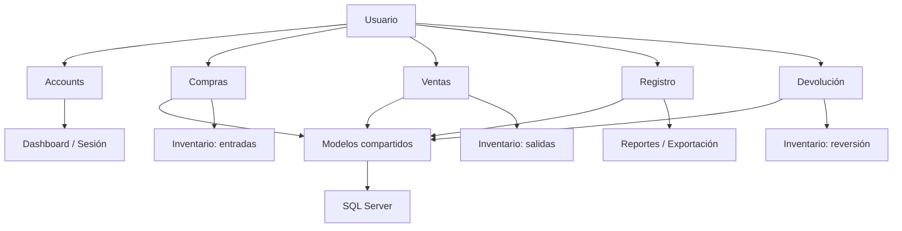

# Ferretería Web

Sistema web para la gestión de una ferretería construido con Django y SQL Server.  
La solución está organizada por módulos funcionales para cubrir autenticación, compras, ventas, inventario, devoluciones y una capa compartida de modelos.

## Resumen del sistema

El sistema centraliza el trabajo operativo en una sola plataforma:

- **Usuarios y autenticación**: acceso, sesión, cambio de contraseña y administración de usuarios.
- **Compras**: registro de compras a proveedores, alta de productos y actualización automática de inventario.
- **Ventas**: punto de venta con búsqueda de productos, clientes y registro de ventas.
- **Registro / Inventario**: consulta, búsqueda, edición rápida, reportes y exportación.
- **Devoluciones**: registro de devoluciones y reversión de stock.
- **Core**: modelos compartidos y punto de integración con la base de datos existente.

## Tecnologías

- Python
- Django 6.0.4
- SQL Server
- ODBC Driver 17 for SQL Server
- HTML, CSS y JavaScript

## Diagrama de interfaces del repositorio



## Estructura general

```text
Ferreteria_Web/
├── manage.py
├── requirements.txt
├── README.md
├── ferreteria/
│   ├── settings.py
│   ├── urls.py
│   ├── asgi.py
│   └── wsgi.py
├── apps/
│   ├── accounts/
│   ├── compras/
│   ├── ventas/
│   ├── registro/
│   ├── devolucion/
│   └── core/
├── static/
│   ├── assets/
│   ├── css/
│   └── js/
└── templates/
    ├── base.html
    └── dashboard.html
```

## Módulos del sistema

### `apps/accounts`
Encargado de la autenticación y administración de usuarios.

Cómo funciona:

- `login_view` valida credenciales, protege contra fuerza bruta y crea la sesión.
- `logout_view` elimina la sesión activa.
- `change_password_view` permite cambiar la contraseña autenticada.
- `create_user_view` crea usuarios solo para administradores.
- `users_list_view` lista usuarios registrados.
- `toggle_user_active_view` activa o desactiva usuarios.
- `forgot_password_local_view` y `password_reset_local_view` soportan recuperación local para pruebas.

### `apps/compras`
Gestiona el proceso de compra a proveedores.

Cómo funciona:

- Carga proveedores y productos asociados.
- Registra compras completas con detalle, factura interna y totales.
- Actualiza inventario con entradas de stock.
- Registra movimientos de inventario para auditoría.
- Permite crear o reutilizar proveedores, categorías y productos desde el mismo flujo.

### `apps/ventas`
Gestiona el punto de venta.

Cómo funciona:

- Muestra el catálogo de productos con stock disponible.
- Permite buscar y crear clientes.
- Registra una venta con su detalle.
- Descuenta inventario al confirmar la operación.
- Guarda los valores en córdobas y convierte cuando la operación se realiza en dólares.

### `apps/registro`
Concentra inventario, trazabilidad y reportes.

Cómo funciona:

- Lista el inventario actual.
- Permite búsqueda por nombre y filtro por categoría.
- Incluye autocompletado de productos.
- Ofrece edición rápida por fila.
- Exporta reportes a Excel.
- Muestra historial de movimientos y alertas de stock.

### `apps/devolucion`
Registra devoluciones asociadas a ventas.

Cómo funciona:

- Busca el producto y la última venta relacionada.
- Evita duplicar devoluciones sobre el mismo producto y venta.
- Crea el registro de devolución.
- Devuelve stock al inventario.
- Crea el movimiento de inventario correspondiente.

### `apps/core`
Capa compartida de base de datos.

Cómo funciona:

- Centraliza los modelos usados por las demás aplicaciones.
- Actúa como puente con las tablas reales de SQL Server.
- Mantiene la lógica de negocio separada del acceso a datos.

## Rutas principales

- `/` → redirección a dashboard o login.
- `/dashboard/` → panel principal.
- `/login/` → inicio de sesión.
- `/logout/` → cierre de sesión.
- `/compras/` → módulo de compras.
- `/ventas/` → módulo de ventas.
- `/registro/` → inventario.
- `/registro/reportes/` → reportes de inventario.
- `/devolucion/` → devoluciones.
- `/admin/` → panel administrativo de Django.

## Configuración del proyecto

La configuración principal está en `ferreteria/settings.py`.

Puntos importantes:

- `DEBUG = True` en desarrollo.
- Base de datos configurada para SQL Server.
- Variables de entorno cargadas desde `.env`.
- `STATICFILES_DIRS` apunta a `static/`.
- Las sesiones expiran por inactividad.

### Variables de entorno esperadas

Crear un archivo `.env` en la raíz con valores similares a:

```env
DB_HOST=TU_SERVIDOR\SQLEXPRESS
DB_NAME=Ferreteria
```

## Instalación y ejecución

### 1. Crear entorno virtual

```bash
python -m venv venv
```

### 2. Activar el entorno virtual

PowerShell:

```powershell
.\venv\Scripts\Activate.ps1
```

### 3. Instalar dependencias

```bash
pip install -r requirements.txt
```

### 4. Ejecutar migraciones de Django

```bash
python manage.py migrate
```

### 5. Levantar el servidor

```bash
python manage.py runserver
```

## Componentes destacados

### Inventario

- Tabla principal de productos.
- Búsqueda por nombre.
- Filtro por categoría.
- Autocompletado.
- Paginación.
- Edición rápida.
- Exportación de reportes.
- Indicadores de stock bajo y agotado.

### Compras

- Selección de proveedor.
- Registro de productos comprados.
- Cálculo de subtotal, impuesto y total.
- Creación automática de factura interna.

### Ventas

- Búsqueda de productos.
- Gestión de clientes.
- Registro de carrito y detalle.
- Descuento automático de inventario.

## Convenciones del proyecto

- `apps/core` concentra los modelos compartidos.
- `models.py` se apoya en `models_legacy.py`.
- La interfaz usa `base.html` como plantilla base.
- Los estilos globales están separados por módulo en `static/css/`.
- La lógica frontend está separada por módulo en `static/js/`.

## Notas importantes

- El proyecto está orientado a una base de datos existente en SQL Server.
- Los modelos de negocio deben mantenerse alineados con las tablas reales.
- El módulo de autenticación usa sesión personalizada.
- El inventario y los movimientos se actualizan desde compras, ventas y devoluciones.

## Autoría

Proyecto interno de ferretería para operación de inventario, compras, ventas y devoluciones.
