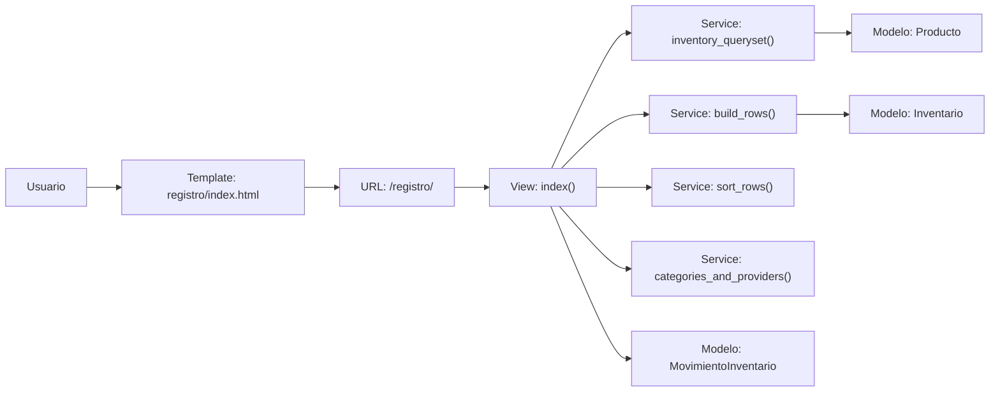
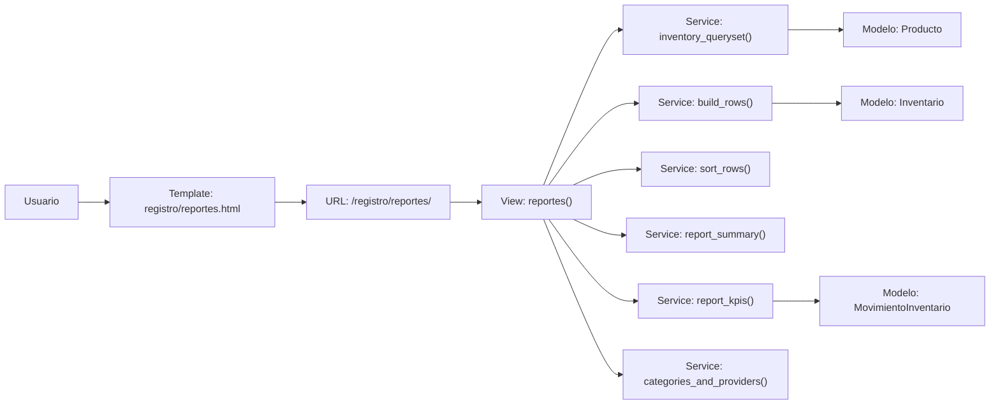

# Ferretería Web

Sistema web de ferretería desarrollado con Django y SQL Server. El proyecto está organizado por módulos funcionales para cubrir autenticación, compras, ventas, inventario, devoluciones y una capa compartida de modelos.

## Estado actual del proyecto

El sistema actualmente incluye:

- Autenticación y gestión de usuarios.
- Módulo de compras a proveedores.
- Módulo de ventas tipo punto de venta.
- Módulo de registro e inventario con búsqueda, filtros, reportes y exportación.
- Módulo de devoluciones.
- Modelos compartidos centralizados en `apps/core`.
- Plantilla base general con menú lateral y dashboard.

## Tecnologías

- Python
- Django 6.x
- SQL Server
- ODBC Driver 17 for SQL Server
- HTML, CSS y JavaScript

## Estructura general

```text
Ferreteria_Web/
├── manage.py
├── requirements.txt
├── README.md
├── ferreteria/
│   ├── settings.py
│   ├── urls.py
│   ├── asgi.py
│   └── wsgi.py
├── apps/
│   ├── accounts/
│   ├── compras/
│   ├── ventas/
│   ├── registro/
│   ├── devolucion/
│   └── core/
├── static/
│   ├── assets/
│   ├── css/
│   └── js/
└── templates/
    ├── base.html
    └── dashboard.html
```

## Módulos del proyecto

### `apps/accounts`
Autenticación y administración de usuarios.

Funciones principales:

- Inicio de sesión.
- Cierre de sesión.
- Cambio de contraseña.
- Creación de usuarios.
- Listado de usuarios.
- Activar / desactivar usuarios.
- Recuperación local de contraseña para pruebas.

Templates asociados:

- `login.html`
- `change_password.html`
- `create_user.html`
- `users_list.html`
- `forgot_password_local.html`
- `password_reset_local.html`

### `apps/compras`
Gestión de compras a proveedores.

Funciones principales:

- Registro de compras.
- Gestión de proveedores.
- Gestión de categorías.
- Creación de productos desde compra.
- Actualización automática de inventario.
- Registro de movimientos de inventario tipo entrada.

Templates asociados:

- `index.html`
- `proveedor.html`

### `apps/ventas`
Punto de venta y ventas a clientes.

Funciones principales:

- Búsqueda de productos.
- Búsqueda y creación de clientes.
- Registro de ventas.
- Actualización automática del inventario.
- Registro de movimientos de inventario tipo salida.

Template asociado:

- `index.html`

### `apps/registro`
Inventario, trazabilidad y reportes.

Funciones principales:

- Listado del inventario actual.
- Filtro por categoría.
- Búsqueda por nombre de producto.
- Autocompletado de productos.
- Paginación del listado.
- Modal de edición rápida por fila.
- Reportes de inventario.
- Exportación a Excel.
- Historial de movimientos.
- Indicadores de stock bajo y agotado.

Templates asociados:

- `index.html`
- `reportes.html`

Archivos relevantes:

- `apps/registro/views.py`
- `apps/registro/services.py`
- `apps/registro/forms.py`
- `static/js/inventario.js`
- `static/css/inventario.css`

### `apps/devolucion`
Registro de devoluciones.

Funciones principales:

- Crear devoluciones.
- Validar relación con ventas anteriores.
- Revertir stock.
- Registrar movimientos de inventario asociados.

Template asociado:

- `index.html`

### `apps/core`
Capa compartida de modelos de base de datos.

Propósito:

- Centralizar los modelos usados por todas las apps.
- Servir como capa de integración con tablas existentes en SQL Server.

Archivos relevantes:

- `models.py`
- `models_legacy.py`
- `migrations/0001_initial.py`

## Rutas principales

- `/` -> redirección a dashboard o login.
- `/dashboard/` -> panel principal.
- `/login/` -> inicio de sesión.
- `/compras/` -> compras.
- `/ventas/` -> ventas.
- `/registro/` -> inventario.
- `/registro/reportes/` -> reportes de inventario.
- `/devolucion/` -> devoluciones.
- `/admin/` -> panel administrativo de Django.

## Diagramas de interfaces de repositorio (Inventario y Reportes)

### Inventario (`/registro/`)



### Reportes (`/registro/reportes/`)



## Configuración del proyecto

La configuración principal está en `ferreteria/settings.py`.

Puntos importantes:

- `DEBUG = True` en desarrollo.
- Base de datos configurada para SQL Server.
- Uso de variables de entorno desde `.env`.
- `STATICFILES_DIRS` apunta a la carpeta `static/`.
- Las sesiones expiran por inactividad.

### Variables de entorno esperadas

Crear un archivo `.env` en la raíz con valores similares a:

```env
DB_HOST=TU_SERVIDOR\SQLEXPRESS
DB_NAME=Ferreteria
```

## Instalación y ejecución

### 1. Crear entorno virtual

```bash
python -m venv venv
```

### 2. Activar el entorno virtual

PowerShell:

```powershell
.\venv\Scripts\Activate.ps1
```

### 3. Instalar dependencias

```bash
pip install -r requirements.txt
```

### 4. Ejecutar migraciones de Django

```bash
python manage.py migrate
```

### 5. Levantar el servidor

```bash
python manage.py runserver
```

## Funcionalidades destacadas de Registro

La pantalla de inventario actualmente incluye:

- Tabla principal de productos.
- Búsqueda por nombre.
- Filtro por categoría.
- Autocompletado con sugerencias.
- Paginación server-side.
- Botón de edición rápida por fila.
- Modal de edición rápida.
- Exportación de reportes.
- Estados visuales de stock.

## Convenciones del proyecto

- `apps/core` concentra los modelos compartidos.
- `models.py` importa desde `models_legacy.py`.
- La interfaz usa `base.html` como plantilla base.
- Los estilos globales están separados por módulo en `static/css/`.
- La lógica frontend está separada por módulo en `static/js/`.

## Notas importantes

- El proyecto está orientado a una base de datos existente en SQL Server.
- Los modelos de negocio deben permanecer alineados con las tablas reales.
- El módulo de autenticación usa sesión personalizada.
- La vista de inventario se ha ido optimizando para ser más usable y rápida.

## Próximos pasos habituales

- Mejorar el control de permisos por rol en la UI.
- Añadir acciones en lote para inventario.
- Completar importación/exportación avanzada.
- Agregar pruebas para vistas y servicios.
- Pulir accesibilidad y responsive design.

## Autoría

Proyecto interno de ferretería desarrollado para operación de inventario, compras, ventas y devoluciones.
